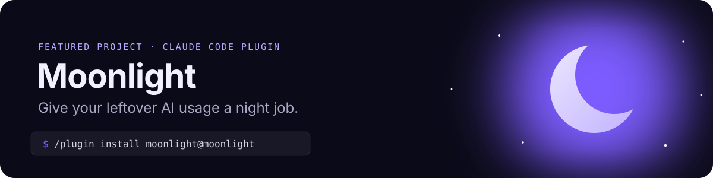

<p align="center">
  
</p>

<p align="center">
  <a href="https://github.com/atty57/moonlight"></a>
  <a href="https://www.linkedin.com/in/atharva-vichare-68739a213"></a>
  <a href="https://portfolio-atty57s-projects.vercel.app"></a>
</p>

### 👋 Hi, I'm Atharva Vichare!
I'm a software developer with a passion for building efficient, scalable solutions. My expertise spans backend engineering, cloud computing, and AI-driven technologies. I enjoy tackling complex problems and continually learning new skills to build impactful software.

<br />

## 🌙 Moonlight

<a href="https://github.com/atty57/moonlight"></a>

Your weekly Claude usage resets on a fixed day, and whatever you haven't used is gone. **Moonlight** is a Claude Code plugin that spends it on your backlog: on the last night before the reset, a cloud agent works through your task queue while you sleep and leaves **draft pull requests** for the morning.

| | |
|---|---|
| **Queue anything** | `/moonlight:add <task>` for code, or research and writing with `repo: none` |
| **Runs in the cloud** | Scheduled as cloud routines inside your sleep window, so your laptop can be off |
| **Safe by default** | Works on its own branches, opens draft PRs only, never merges |
| **Loses nothing** | Pushes after every step, so hitting the usage limit never loses work |

```text
/plugin marketplace add atty57/moonlight
/plugin install moonlight@moonlight
/moonlight:setup
```


<br />

## 🛰️ Open Source · `microsoft/agent-framework`

Microsoft's SDK for building AI agents and multi-agent workflows in **Python** and **.NET**. I work where agents meet the real world: the approval loops, protocol adapters and state handoffs where things quietly break.

> [!NOTE]
> **Focus:** human-in-the-loop tool approval · AG-UI / A2A protocol interop · memory · observability

#### ✅ Merged

| PR | Stack | What broke → what I fixed |
|---|---|---|
| [#7271](https://github.com/microsoft/agent-framework/pull/7271) | Python | **Double execution on approval.** After a human approved a tool call, the round-trip ran the function a second time. Now an approved call runs exactly once. |
| [#7474](https://github.com/microsoft/agent-framework/pull/7474) | .NET | **Unbounded auto-approval loop.** Put a hard bound on the tool-approval auto-approval loop so an agent can't spin without limit. |
| [#7635](https://github.com/microsoft/agent-framework/pull/7635) | Python | **Broken memory provider.** The Cosmos DB memory provider was still calling a renamed `add_cosmos` toolkit API; rewired it to the current one. |
| [#7655](https://github.com/microsoft/agent-framework/pull/7655) | Python | **Lost attachments over AG-UI.** File attachments were silently dropped when the URL arrived in `source.value`; they now make it through. |
| [#7951](https://github.com/microsoft/agent-framework/pull/7951) | Python | **Crash on shutdown.** `A2AAgent` threw an `AttributeError` on exit when the caller supplied their own `http_client`; fixed the teardown path. |

#### 🔄 In review

| PR | Stack | Change |
|---|---|---|
| [#8665](https://github.com/microsoft/agent-framework/pull/8665) | Python | Correct tool-argument validation for `datetime`, `set` and `tuple` parameters |
| [#8465](https://github.com/microsoft/agent-framework/pull/8465) | .NET | Fix AG-UI `Unknown chat role: reasoning` error on follow-up turns |
| [#8265](https://github.com/microsoft/agent-framework/pull/8265) | .NET | Preserve the agent continuation token when wrapped with `UseOpenTelemetry` |
| [#8018](https://github.com/microsoft/agent-framework/pull/8018) | .NET | Surface the real workflow exception instead of a JSON serialization error |
| [#7920](https://github.com/microsoft/agent-framework/pull/7920) | .NET | Stop AG-UI SSE events from being written with explicit `null`s |

<a href="https://github.com/microsoft/agent-framework/pulls?q=is%3Apr+author%3Aatty57"></a>

<br />

## 🛠️ Skills & Tools

**💻 Languages & Frameworks**
<p align="left">            </p>

**☁️ Cloud & Infrastructure**
<p align="left">         </p>

**🧠 Machine Learning & AI**
<p align="left">           </p>

**🤖 GenAI & Agentic Systems**
<p align="left">            </p>

**📚 Familiar with LLMs**
<p align="left">       </p>

<br />

## 🚀 Interests
- Building scalable backend systems.
- Developing cloud-native applications.
- Exploring Large Language Models (LLMs) and their applications.

## 📫 Connect With Me!
Feel free to connect - I'm always excited to collaborate or discuss interesting projects!

Linkedin - https://www.linkedin.com/in/atharva-vichare-68739a213

<br />

<p align="center"><sub>☾ built by day · shipped by night</sub></p>
